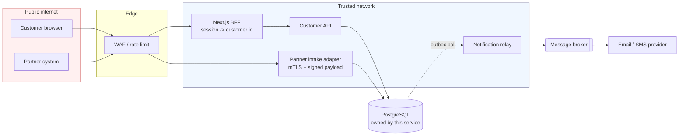

# Production design

How I would evolve this exercise into a system I would be willing to operate.

It is written against what was actually built — the vertical slice described in [ISSUES.md](ISSUES.md), with the reasoning in [DECISIONS.md](DECISIONS.md) — rather than from a blank page. Where the exercise already establishes the right invariant, this note says so and describes what carries it at scale; where the exercise takes a shortcut, it says which one and what replaces it.

## Where the exercise landed

Four invariants now hold at the write path, and they are the foundation everything below builds on:

1. **One logical partner event has exactly one effect.** Enforced by a composite unique constraint, not by an application-level check that races.
2. **Current state describes the newest accepted event**, not the last HTTP request received.
3. **The domain change and the intent to notify commit together or not at all**, in one transaction.
4. **A notification that fails is retried with bounded, jittered backoff, and ends in a dead-letter queue an operator can inspect and replay.**

Point 3 matters more than it looks, and it is worth naming explicitly because it determines most of the messaging design below. Writing the application row, the history row and the notification job in a single transaction is the **transactional outbox pattern**: `NotificationJob` *is* an outbox. It means this system has no dual-write problem between its database and its messaging — there is no window in which state changed but the intent to notify was lost, and none in which a notification was promised for a change that rolled back.

That property is preserved in everything that follows. Most of the work below is replacing shortcuts around it, not replacing it.

---

## 1. Service and data boundaries

### The boundary that matters

The repository has two HTTP routes with fundamentally different trust models, currently served by one process on one port:

| | Customer read | Partner event intake |
|---|---|---|
| Caller | End user's browser session | Machine, over the public internet |
| Identity | A person, authenticated | A system, with credentials we issue |
| Failure impact | One customer sees an error | State stops flowing for every application |
| Traffic shape | Interactive, low, bursty on login | Machine-paced, bursty on partner batch runs |
| Availability need | High | **Higher** — the partner retries, but a long outage backs up their queue |

These want different rate limits, different authentication, different scaling, and different on-call urgency. Serving them from one process means a partner traffic spike degrades the customer portal, and a customer-facing deploy risks dropping partner events.

**Split them into two deployables** sharing the domain library:



The two write paths still share one database and one domain module. **I would not split the database.** The application, its history and its outbox must commit atomically; separating them into services would replace a transaction with a distributed protocol and buy nothing at this size. Service boundaries here are about trust and blast radius, not about data ownership.

### Data boundaries

- **One service owns this schema.** No other service reads these tables directly — the failure mode of a shared database is that every consumer becomes a coupled deployment. Other services get an API or a published event.
- **SQLite becomes PostgreSQL.** Not for size, for four specific capabilities the slice had to work around: `SELECT … FOR UPDATE SKIP LOCKED` for worker claiming, partial indexes for the outbox poll, native enums for `status` columns currently typed as `String`, and a real migration story instead of `db push --accept-data-loss`.
- **Least-privilege database roles.** The API role can write applications, history and outbox rows but cannot alter schema. The worker role reads applications and writes only outbox state. Migrations run as a third role in a separate job.

### The web app

`apps/web` reaches the API server-side from a React Server Component — which is why removing CORS broke nothing ([DECISIONS.md D3](DECISIONS.md)). That is the right shape and I would keep it: the Next.js server is a **backend-for-frontend**, holding the session and exchanging it for a customer identity. The browser never talks to the customer API directly and never holds a token that addresses it.

---

## 2. Idempotency, ordering, retries and dead letters

### Idempotency

The mechanism built in the slice is the one I would keep: **a unique constraint on the natural key**, `(applicationId, sourceEventId)`, with a pre-check as a fast path and the constraint as the guarantee. It is race-safe because the database is the arbiter, and it survives code paths nobody has written yet.

Two changes at scale:

- **A generic idempotency-key table** once there is more than one integration endpoint, storing the original response so a retry replays it verbatim rather than recomputing it. The `Idempotency-Key` header (IETF draft) is the interface; per-endpoint natural keys stop scaling once endpoints multiply. This was rejected for the slice as overbuilt for one caller ([D4](DECISIONS.md)) and becomes correct at roughly the third integration.
- **A retention policy.** Idempotency records cannot grow forever. A window comfortably longer than the partner's maximum retry horizon — 30 days is typical — after which keys age out and a very late redelivery would be reprocessed. That residual risk is accepted and documented rather than solved.

### Ordering

Today ordering is decided by comparing `occurredAt` against the newest accepted event in history. That trusts the partner's clock, which is the weakest part of the current design.

**Production: require a per-application monotonic sequence number from the partner.** Ordering then becomes integer comparison, immune to clock skew, daylight-saving transitions and clock resets. This is a contract change, so it could not be built here ([D7](DECISIONS.md)).

Until it exists, the timestamp comparison stays, with two mitigations: alert on events whose `occurredAt` is implausibly far from receipt time (a partner clock problem shows up as a cluster of these), and keep rejecting only strictly-older events so a tie is never silently dropped.

If the intake path later moves onto a broker, **partition by `applicationId`** so per-application order is preserved in transit. Global ordering is neither needed nor affordable; per-entity ordering is both.

### Retries and dead letters

The policy built here — exponential, jittered, capped, bounded, then dead-lettered — is the right *policy*. What changes is where it runs.

| | Now | Production |
|---|---|---|
| Claiming | None; a second worker double-sends | `SELECT … FOR UPDATE SKIP LOCKED`, or the broker's own visibility timeout |
| Scheduling | `nextAttemptAt` polled every second | Broker-native delay, or the same column with a partial index |
| Dead letters | `status = DEAD_LETTERED` in the same table | Broker DLQ, or the same column — both work |
| Replay | CLI over exported functions | Authenticated operator endpoint with an audit record of who replayed what |

**The multi-worker gap is the most significant thing the slice deliberately left open** ([ISSUES.md #7](ISSUES.md)). Two workers currently select the same rows and both send. The fix is a claim step:

```sql
UPDATE notification_job SET status = 'IN_PROGRESS', locked_by = $1, locked_at = now()
WHERE id IN (
  SELECT id FROM notification_job
  WHERE status = 'PENDING' AND (next_attempt_at IS NULL OR next_attempt_at <= now())
  ORDER BY created_at
  FOR UPDATE SKIP LOCKED
  LIMIT 20
)
RETURNING *;
```

`SKIP LOCKED` is what makes this work: competing workers step over each other's locked rows instead of blocking. It has no SQLite equivalent, which is why simulating it here would have demonstrated a mechanism production would not use.

A claim needs a **lease**, not just a flag: `locked_at` plus a reaper that returns rows held past a timeout, or a worker that dies mid-batch strands its jobs forever.

**Whether to keep the outbox or move to a broker** is a real fork:

- *Keep polling.* One fewer system, transactional guarantees end to end, trivially debuggable. Fine to five figures of events per day.
- *Relay to SQS/Kafka.* Outbox stays the source of truth; a relay publishes and marks rows sent. Fan-out to more consumers, broker-native retries and DLQ, better burst absorption — at the cost of a second system and a delivery path that is no longer one transaction.

I would keep polling until fan-out is actually needed, and I would **not** replace the outbox with direct publishing at any scale — that reintroduces the dual-write problem the current design already avoids. Change data capture (Debezium on the WAL) is the third option and is worth it only when several services need the stream.

**At-least-once is permanent.** No design removes the window between the provider accepting a send and us recording it. The mitigations are the ones already in place — the idempotency key on every provider call — plus a provider that honours it. `MockEmailProvider` ignores the key entirely, so today nothing verifies that end of the contract; a production integration must be chosen partly on whether it supports idempotency keys, and that behaviour needs a contract test.

---

## 3. Authorization and protection of sensitive data

### The partner boundary

Unauthenticated today, by the exercise's own scoping. Production needs, in order of importance:

1. **mTLS** between partner and intake, or a signed payload if the partner cannot do client certificates.
2. **HMAC signature over the raw request body**, with a timestamp inside the signed material and a short acceptance window, so a captured request cannot be replayed. The signature must be verified against **the raw bytes before parsing** — verifying a re-serialised body is a well-known bypass.
3. **Per-partner credentials, rotatable without downtime** — accept two valid keys during rotation.
4. **Network placement**: separate ingress, IP allow-list where the partner has stable egress, rate limits sized to their expected batch shape.

The trust boundary is worth stating plainly: **the partner is authenticated, not trusted.** Everything it sends is still validated, deduplicated, ordering-checked and transition-checked. Authentication answers "is this really them"; it never answers "is this event sane".

### The customer boundary

`x-customer-id` is a caller-controlled header and must never survive to production. It is replaced by a session established through the identity provider, held server-side by the BFF and exchanged there for a customer identity. Short-lived tokens, rotation on privilege change, revocation on logout.

**Object-level authorization stays exactly where it is** — expressed as a query filter, so the compiler requires an identity and there is no branch to forget ([D1](DECISIONS.md)). On top of that, **PostgreSQL row-level security** as defence in depth: the session sets the customer identity, and a policy makes it impossible for any query — including one written by a future bug — to return another customer's row. Application-level authorization can be wrong; RLS is the backstop that makes being wrong non-fatal.

**Non-disclosure of existence** stays as designed: a foreign application and a nonexistent one return byte-identical `404`s, with the distinction recorded server-side only ([D2](DECISIONS.md)).

### Sensitive data

Everything here is synthetic, but the shape is a lending product holding names, contact details and financial positions.

- **In transit**: TLS everywhere, including inside the trusted network.
- **At rest**: volume encryption as a baseline, plus **field-level encryption for contact details**, so a database dump is not immediately a contact list. Envelope encryption with keys in a KMS, not in the application.
- **In logs**: the intake route currently logs the whole parsed event, including the free-text `reason`, which is operator-authored text that can contain anything. Production redacts by allow-list — log the event id, the status and the outcome, never the payload.
- **In the partner response**: already narrowed to exclude customer contact details ([D6](DECISIONS.md)). The same rule generalises — every response is a deliberate projection, never the entity.
- **Retention and erasure**: a deletion request conflicts directly with an immutable, evidentially useful history. The resolution is to separate identity from event: keep the event record, **crypto-shred** the personal data by destroying that subject's key. The audit trail survives, the personal data does not.

---

## 4. Auditability and evidence

DOMAIN.md says history *"is customer-visible and may later be used as operational evidence"*. Those are two requirements, and the slice deliberately did not merge them ([D7](DECISIONS.md)).

**Customer-visible history** is the record of what happened to the application: only accepted events, ordered, safe to render. A stale or invalid event never appears — showing a customer a status that was never theirs would be misleading.

**The audit log** is the operator's record of what the system was *told* and what it decided. It records events that were rejected, which is precisely what you need when a partner asks why their event did not take effect. Today those decisions only reach a log line, which is not queryable evidence — this is the main gap in the current implementation.

The production shape:

| Field | Purpose |
|---|---|
| `occurredAt`, `receivedAt` | Partner clock and ours, separately — the gap between them is diagnostic |
| `actor` | Which partner, which credential, which operator |
| `action`, `outcome` | The `ACCEPTED / DUPLICATE / STALE / INVALID_TRANSITION` discriminator already built |
| `before`, `after` | State either side of the change |
| `correlationId` | Ties the entry to logs and traces |
| `payloadDigest` | Hash of the raw body — proves what was received without storing it |

Append-only, enforced by permissions rather than convention: the application role gets `INSERT` and no `UPDATE` or `DELETE`. For genuine tamper-evidence, hash-chain each entry to its predecessor so any retroactive edit breaks the chain.

Operator actions belong in the same log. The replay CLI built here writes nothing about who replayed what ([D13](DECISIONS.md)); an authenticated operator endpoint should record the actor, and that is a reason to prefer the endpoint over the CLI beyond convenience.

---

## 5. Observability and incident diagnosis

Design this around the questions actually asked during an incident, not around what is easy to emit.

**"Did this customer get told?"** — the most common support question. Answerable by joining the application, its history and its outbox rows on `sourceEventId`. Needs the event id present in logs, traces and the audit entry.

**"Is the partner integration healthy?"** — the `outcome` discriminator built in [D6](DECISIONS.md) is directly a metric dimension. A rising `INVALID_TRANSITION` rate means the partner's state machine and ours have diverged, which is an integration incident that would otherwise be invisible. A rising `DUPLICATE` rate means they are retrying more, usually because we are slow. A rising `STALE` rate means delivery is being reordered or their clock has drifted.

**"Are notifications flowing?"** — queue depth is the obvious metric and the wrong one to alert on. **Oldest pending job age** is the SLI: depth can be high and healthy during a burst, but an old pending job always means something is stuck.

| Signal | Alert on |
|---|---|
| Oldest pending outbox age | > 5 minutes — page |
| Dead-letter arrivals | Any sustained rate — page; a single one — ticket |
| `INVALID_TRANSITION` rate | Sharp rise — partner integration diverged |
| Provider error rate / latency | Sustained rise — usually precedes dead letters |
| API RED metrics per route | Standard rate, errors, duration |

**Tracing.** OpenTelemetry, with the trace context carried *through the outbox row* so the span from partner request to provider call is one trace despite the asynchronous hop. This is the single highest-value observability addition, because the interesting failures all span that boundary.

**Logs.** Structured JSON, correlation id on every line, redaction by allow-list. Fastify's logger is already structured; what is missing is correlation and redaction.

**Runbook entries** worth writing before they are needed: dead letters accumulating; partner reporting events not applied; oldest-pending-age alarm; provider outage.

---

## 6. Deployment, migration, rollback and backward compatibility

### Deployment

Containers, API and worker deployed separately — they scale on different signals and fail independently. Rolling deploys with health gating for the API; the worker can stop and restart freely, provided shutdown drains the current batch, which was fixed here ([D14](DECISIONS.md)).

Config through environment, secrets from a manager, validated at startup so a missing secret fails the deploy rather than the first request that needs it.

### Migrations

`prisma db push --accept-data-loss` is a development convenience and must not exist in the deployment path. Production uses versioned migrations (`prisma migrate deploy`) run as a separate job before the new version starts.

**Every schema change follows expand–contract**, in separate releases:

1. **Expand** — add the new column, nullable, with a default. Deploy. Nothing reads it.
2. **Backfill** — populate in batches. Deploy code that writes both.
3. **Migrate reads** — switch reads to the new column. Deploy.
4. **Contract** — drop the old column, at least one release later.

The `NotificationJob.status` column added in [D10](DECISIONS.md) is a worked example. In this exercise it was added and adopted in one step, which is fine against a database that is recreated. In production: add `status` nullable; backfill from `processedAt` and `attemptCount`; switch the poll query; drop the old index. Four releases for one column, and that is the cost of not taking downtime.

### Rollback

Rollback is a code deploy, never a down-migration. The constraint that makes this work: **the schema must tolerate the previous version of the code for at least one release.** Any migration that would break the running version — dropping a column it still writes, adding a `NOT NULL` without a default — is by definition unsafe to deploy, regardless of what the new code needs.

Behaviour changes ship behind flags so they can be reverted without a deploy. The transition rules from [D8](DECISIONS.md) are the obvious candidate: they encode an **assumption** about whether a decline is permitted after an offer, and being able to loosen that in seconds rather than in a release cycle is worth the flag.

### Backward compatibility

The exercise contains a live example of getting this wrong, and it is worth being explicit about.

Changing the accepted-event response from `202` to `200` ([D6](DECISIONS.md)) is **a breaking change to the partner contract.** A partner asserting `status === 202` breaks the moment it deploys. That is acceptable in an assessment and not acceptable in production.

The compatible sequence would have been:

1. Add the `outcome` field additively, keep returning `202`. Partners ignore unknown fields, so this breaks nobody.
2. Tell partners to switch to reading `outcome`, with a deadline.
3. Change the status code behind a version — a new path, a media type, or a per-partner flag — once they have.

The general rules: **additive changes are safe; removals and semantic changes are not.** New response fields, new optional request fields, new `outcome` values — safe, provided consumers ignore what they do not recognise, which is worth stating in the partner contract. Removing a field, tightening validation, or changing the meaning of an existing value requires a version and an overlap period during which both are served.

---

## 7. Tradeoffs, and what I would postpone

### What I would do first, in order

1. **PostgreSQL.** Unblocks worker claiming, partial indexes, native enums and real migrations. Several items below are waiting on it.
2. **Partner authentication.** The intake endpoint is currently open, and everything else is defence behind an open door.
3. **Real customer sessions plus RLS.** The header stand-in cannot ship.
4. **Worker claiming with `SKIP LOCKED`.** Until this exists, the system runs exactly one worker, which is a scaling ceiling and a single point of failure.
5. **Tracing through the outbox, and the outcome metrics.** Cheap, and they determine how quickly everything after this is diagnosed.
6. **The audit table.** Rejected events currently leave no queryable trace.

### What I would postpone, and why

**A message broker.** The outbox already gives transactional safety, and polling is adequate well beyond current volumes. Adding a broker before fan-out is needed buys operational surface, not reliability.

**Event sourcing.** History is already an append-only log of accepted changes, which delivers most of the auditability benefit. Full event sourcing would mean rebuilding state from events and taking on projection and versioning complexity for a six-state machine.

**Per-job retry policies.** Real in a mature queue. Speculative with one job type.

**A workflow engine** (Temporal or similar). Justified when there are long-running, multi-step, compensating processes. This is one state machine and one notification.

**Multi-region.** Not until there is a latency or residency requirement to point at.

### The tradeoffs I would defend

**Correctness over throughput, deliberately.** Every event now costs a transaction, two indexed reads and a constraint check. That is measurably slower than the original. It is also the difference between a loan record you can trust and one you cannot, and at partner event volumes the cost is irrelevant.

**Database-enforced invariants over application checks.** More rigid — a unique constraint cannot be argued with, and adding one to a table with existing duplicates is a migration problem. That rigidity is the feature. Application-level checks are optional in a way constraints are not, and this codebase already demonstrated where that leads.

**Rejecting stale events rather than recording them.** Cleaner customer-visible history at the cost of losing the fact that a late event arrived — mitigated by a log line now and the audit table later. If the audit table is not built, this trade gets worse over time, which is why it is high on the list above.

**Preferring to accept a questionable transition over rejecting a legitimate one** ([D8](DECISIONS.md)). Deliberate: a rejected legitimate decline strands a customer silently, which is worse than accepting a decline the business considers unusual. If the partner confirms declines cannot follow an offer, the transition map is one place to change.

**A CLI rather than an endpoint for replay** ([D13](DECISIONS.md)). The right call given there is no operator authentication, and the wrong long-term shape — it requires shell access and records nothing about who acted. It moves behind an authenticated endpoint once operator identity exists.
